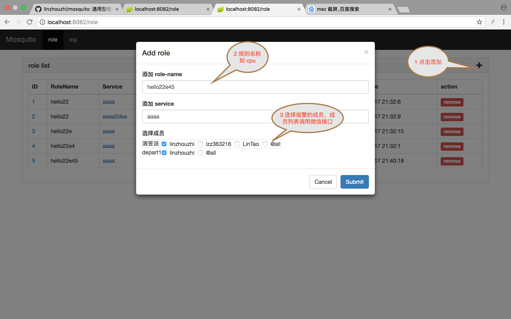
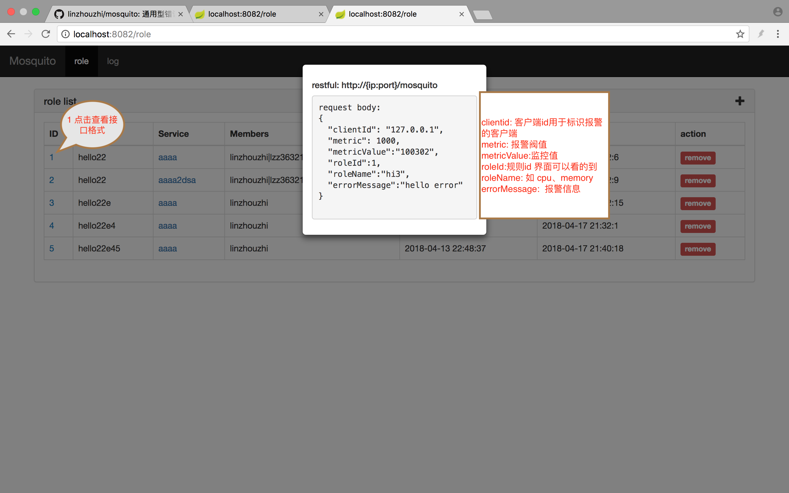
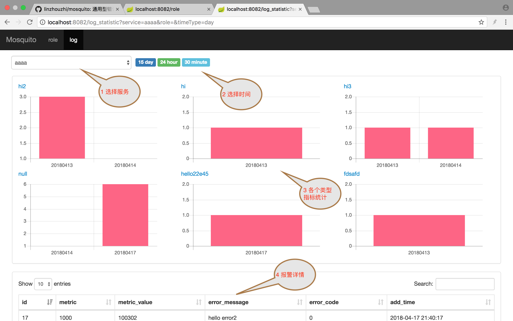
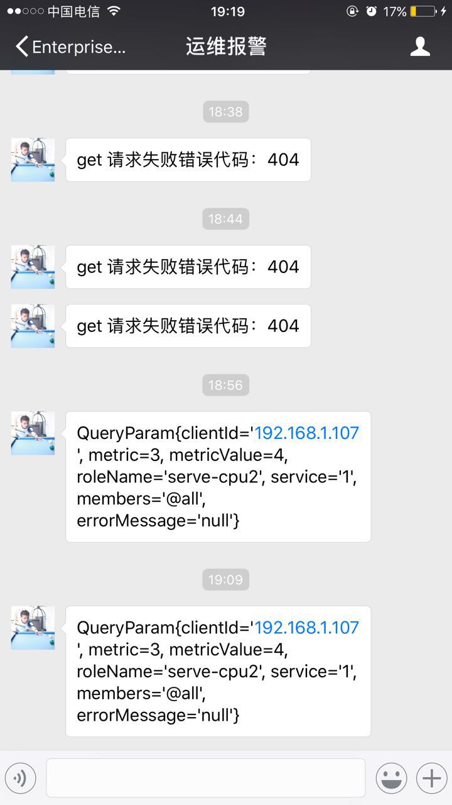

# mosquito
> mosquito 错误报警监控系统，mosquito 像一只蚊子一样你不处理它就会烦，当程序出现错误的时候会通过一直通过微信进行报警并且统计错误信息

## 一、介绍
    很多公司对错误的报警方式都是通过邮件提醒的，但是这种方式跟微信比起来就显得不及时了，因为微信我们有信息都会看的，所以要是有错误报警就不会错过

## 二、安装
> 安装主要分为三个步骤，申请微信企业号、配置 mysql 数据库、运行 Application 就可以了。

* 1 申请微信企业号获取 corpid corpsecret,配置到 application.properties 文件中
* 2 创建 mysql mosquito 数据库，在 applicationContext.xml 修改配置数据库配置
* 3 运行 Application，查看 http://localhost:8082/role

## 三、使用
> mosquito 有两个界面一个 role 界面用于添加报警规则，第二个界面是 log 用于统计报警的次数以及微信接口发送的状况，具体使用步骤如下

### 3.1 add roles
> 添加 role 每一条 role 就是一个报警规则，添加完成会在 role 界面显示



### 3.2 查看接口格式
> 直接点击 roleid 可以查看接口格式



### 3.3 log 查看
> 通过图表展示报警情况


### 3.4 例子
```
metric:是报警阀值
metricValue: 是具体监控值，当这个值超过 metric 就会微信报警
service：是 service 的名称
clientId: 是你的客户端 ip,这样你可以在你的电脑上直接看到你到监控结果
roleId: 规则 id,role 界面可以查看的到
errorMessage: 报警到信息

post
http://localhost:8082/mosquito
{
  "clientId": "127.0.0.1",
  "metric": 1000,
  "metricValue":"100302",
  "roleId":5,
  "errorMessage":"hello error"
}
```

### 3.5 微信报警结果



企业号
m:lzz36321*
y:linzhouzhi36321@qq.com
=======
